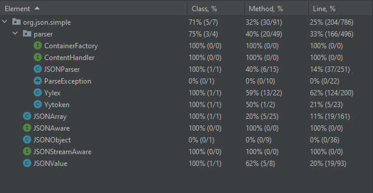
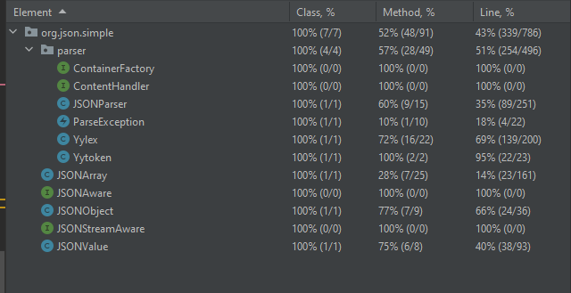

# 
Sharif University of Technology Department of Computer Engineering Software Engineering Lab

## Students Info:

### Ali Najibi, 98106123  Alireza Honarvar, 98102551

## General Info:

In this experiment, our task is to increase the coverage of the test cases for the given program.
To achieve this goal, we firstly need to understand the program and its functions. Then we need to write test cases for
the program. After that, we need to run the test cases and see the coverage of the program. Finally, we need to write
new test cases to increase the coverage of the program.

The coverage results of the project before adding our own test cases are as follows:

The results of running the test cases are saved in coverageResults/Before/index.html, and you can
check them out by opening the file in your browser.

Now, let's add test cases to increase the coverage of different classes, I will briefly
explain the functionality these test cases are testing.

1. `testJSONObjectMap` this test case is testing the functionality of the `JSONObject` class. It is
   testing the `put` method of the class. This method is adding two new key-value pair to the map of the class.
   Then, using the `toJSONString` method, we test to see if the map is correctly converted to a string
   representation of the map. To check if the map is correctly converted to a string, we use the `String.contains`
   method
   to check if the string contains the key and value of the map. If the string contains the key and value, then the map
   is correctly converted to a string.

2. `testExceptionHandling` this test case tests the exception handling capability of the project, since
   an input string may contain different types of malformed JSON strings, the program should be able to handle
   these exceptions. This test case tests the `parse` method of the `JSONValue` class. This method tries to parse
   the input string and if the input string is malformed, it returns `null`.
   So, we test to see if the method returns null for different types of malformed JSON strings.

3. `testEncode` this test case is similar to an End-to-End test, it firstly creates two JSON
   entities, a `JSONArray` and a `HashMap` then, as we know, javascript does not limit the type of
   the values in an array to be the same, and does not have any limit on key-value pairs of an object,
   thus we try to accumulate these two entities with some values, for example we fill the
   `JSONArray` with `string`, `Long`, `Double`, `Boolean` and `null`. Moreover, we accumulate
   the object with the same types with respective string keys.
   Then we add the `HashMap` to the array, now to test the functionality of the project,
   we firstly encode the array to text, and then decode it back to an array. Then we check
   if the decoded array is equal to the original array. To check if the decoded array is equal
   to the original array, we use the `assertEquals` method.

4. `testYytokenToString` since the toString method for the class Yytoken has not been used
   in any part of the code, and the parse method does not return any kind of this token to test
   it internally, we write a specific test for this class to test the functionality of the toString
   method of this class. We create a new instance of this class and set the value of the token
   to a string, then we check if the toString method returns the same string that we set for the
   token.

The coverage result of the project after adding our own test cases are as follows:

The results of running the test cases are saved in coverageResults/After/index.html, and you can
check them out by opening the file in your browser.

## Results

As you can see from the above images, the coverage results have been improved significantly in
all classes in terms of 'class coverage', 'method coverage' and 'line coverage'.

The improvement percentage of the coverage results are as follows:

| Path            | Class Coverage | Method Coverage | Line Coverage |
|-----------------|----------------|-----------------|---------------|
| org.json.simple | 29%            | 19%             | 18%           |
| JSONArray       | 0%             | 8%              | 3%            |
| JSONObject      | 100%           | 77%             | 66%           |
| JSONValue       | 0%             | 20%             | 20%           |
| JSONParser      | 0%             | 17%             | 21%           |
| ParseException  | 100%           | 10%             | 18%           |
| Yylex           | 0%             | 22%             | 7%            |
| Yytoken         | 0%             | 50%             | 74%           |

As you can see from the results above, the coverage results have been increased in all classes and in
all aspects.